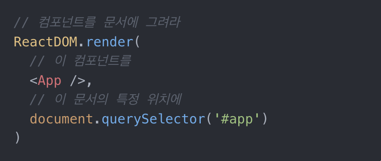

# learn-react

### 1. 순수 자바스크립트와 MVC 디자인 패턴으로 결과물을 만들며 UI 라이브러리의 필요성을 깨달아보기
  - 자바스크립트
    - view는 dom을 조작해 실제로 화면을 그리고, 이벤트를 발행한다.
    - model은 store 로 구현하였고, 데이터만 관리한다. view를 제어하는데 사용할 '상태'를 다룬다.
    - controller는 store의 데이터를 view로 전달하거나 view에서 보내는 이벤트를 보고 store의 데이터를 갱신하는 방식으로 화면을 제어한다.
  - 리액트
    
      
    
    - 모델은 스토리지만 갖고 있고 다른 `어플리케이션 상태`는 컴포넌트로 위임한다. 
    - 컴포넌트의 `state`로 관리되는 상태는 `render()` 함수가 반환하는 리액트 엘리먼트와 유기적으로 연결되어 화면에 출력된다. 
    - state의 변화가 UI까지 자동으로 영향을 끼친다.

### 2. React 개념 이해하기
  - **가상돔**
    - '`DOM 트리 생성` -> `CSSOM 트리 생성` -> `렌더트리 결합` -> `레이아웃 계산` -> `화면에 그림`' 이러한 일련의 과정들이 반복되기 때문에 브라우저 성능에 영향을 줄 수 있음
    - DOM api 호출을 적게 사용하기 위해 돔 호출을 일종의 캐시 처리를 하기 위해 '`가상돔`' 을 만들었다.
    - 리액트는 렌더링할 때마다 전체 가상돔을 만들고 이전 가상돔과의 차이를 찾는다. 차이가 있는 부분만 실제 돔에 반영하고 차이가 없으면 렌더링 요청이 있더라도 무시하는 방식으로 성능을 낸다. 즉 최소한의 연산만으로 화면을 그린다.
    - 이때 리액트 엘리먼트를 가상돔으로 만들어 비교 할 때, 트리 비교시 O(n^3)만큼의 계산 복잡도를 가지기 때문에 좀 더 효율적인 계산을 위해 재조정 알고리즘을 사용한다.
      - 엘리먼트 타입이 다를 경우
      - key 값이 다를 경우
      
  - **JSX** 
    - Vue와 달리 리액트는 템플릿 언어를 지원하지 않는다. UI 코드의 가독성을 위해서 리액트는 `JSX 문법`을 사용한다.
    - 문법 모양이 마크업과 비슷하고, 돔 구조와 유사하기 때문에 가독성이 높아진다.
    - html 문서를 작성하듯이 언어를 쓰면 되지만 주의할 것은 attribute 작성법이다. JSX에서 attribute를 사용할 때는 카멜 케이스를 사용한다. 또한 `class는` `className`이라는 속성을 따로 사용한다.
    - JSX에서 엘리먼트 속성에 자바스크립트 표현식은 중괄호를 사용해 표현한다.

  - **생명주기(Life cycle)**
    - 리액트 컴포넌트도 생성부터 소멸까지 일련의 생명주기를 갖는다
      - 컴포넌트 객체 생성(`constructor`) -> 가상돔을 그리고 실제 돔에 반영-`마운트`(`render`) -> 마운트 완료시 이벤트 바인딩/외부 데이터 작업 수행 -> `언마운트`

  - **컴포넌트(Component)**
    - **클래스 컴포넌트**
      - React.Component를 상속해서 만드는 컴포넌트
      - render 메서드로 리액트 element를 반환해서 dom을 만든다.
      - ReactDOM.render() 함수를 이용해 클래스를 element로 전환한다.
      
    - **함수 컴포넌트**
      - 리액트 element를 반환하는 함수
        - 상속, 생성자, render 메서드도 없어서 코드가 짧고, state가 없다.
        - 내부 상태를 사용할 필요가 없다면 함수 컴포넌트를 이용하면 좋다.
        - 이 때 변화하는 상태는 props로 받을 수 있다.

  - **useRef VS useState**
    |useRef|useState|
    |------|--------|
    |Reference 객체를 생성|State를 생성|
    |컴포넌트 내부의 변수로 활용 가능|컴포넌트 내부의 변수로 활용 가능|
    |어떤 경우에도 리렌더링을 유발하지 않음|값이 변경되면 컴포넌트 리렌더링|
    |특정 DOM 요소에 접근 가능|
    - useRef는 렌더링에 영향을 미치지 않아야하는 변수를 생성할 때 활용

  - **단방향 데이터 흐름**
    - React는 단방향 데이터 흐름을 가져서 데이터 흐름을 추적하기 용이하게 한다.
    - (Vue는 양방향 데이터 바인딩이 가능, 리액트는 불가) 
  
  - **useEffect**
    - 사이드 이펙트를 제어
    - Vue의 `watch` 혹은 `watchEffect`와 비슷해보임
    - 차이점은 의존성 배열을 명시해야한다는 것!
    - 리액트의 state는 항상 비동기로 변경된다.
    - useEffect 안에서 상태가 변경되면 추가적인 렌더링이 발생하면서 콜백함수 실행
    - ==> 특정한 상태의 변경을 감지한 후의 단계를 구현할 때 사용하면 유용하다.

  - **useReducer**
    - 컴포넌트 내부에 새로운 state를 생성하는 hook
    - 모든 useState는 useReducer로 대체 가능
    - **상태 관리 코드를 컴포넌트 외부로 분리할 수 있다.**
      - (useState로 만든 state는 컴포넌트 내부에서만 접근 가능하기 때문에 상태 관리 코드도 내부에 작성해야함)

  - **useMemo**
    - `Memoiaztion(메모이제이션)` 기법을 기반으로 불필요한 연산을 최적화하는 hook (자매품: useCallback)
      - 반복적으로 수행되는 동일한 연산을 할 때 최초의 연산 결과값을 메모리에 보관하다가 돌려주는 기법 -> 불필요한 연산 방지로 최적화
    -  Vue의 `computed`와 비슷한 느낌 - 종속성이 변경되지 않으면 이전 값을 캐싱하여 성능 최적화
      - **다만 useMemo 그 자체로는 렌더링을 다시 트리거하지 않음.** 즉 값을 메모이제이션할 뿐이다.
        - 종속성 배열을 명시적으로 작성하고, 그에 따라 다시 연산되어 반환된 값을 통해 리렌더링하는 방향으로 작업 가능
    
  - **React.memo**
    - 컴포넌트를 인수로 받아 최적화된 컴포넌트로 만들어 반환
    - 자신이 받는 **props**가 바뀌지 않으면 리렌더링이 발생하지 않도록 메모이제이션
    - 다만 객체 타입처럼 주소값을 참조하는 형태의 props를 받게 되는 경우 최적화되지 않음
      - 이 때 **두 번째 인수로 넣을 수 있는 콜백 함수**를 이용해 리렌더링의 조건을 스스로 판단하지 않도록 최적화를 커스텀할 수 있다.
      - 두 번째 인수의 콜백 함수의 매개 변수로는 이전의 props의 값과 이후의 props의 값을 받을 수 있다. 이를 이용한 반환 값에 따라서 판단하게 된다.
        - true를 반환하면 props에 변경점이 없다고 판단 -> 리렌더링X
        - false를 반환하면 props에 변경점이 있다고 판다 -> 리렌더링

  - **useCallback**
   - 첫 번째 인수로 함수를, 두 번째 인수로 종속성 배열을 받음
   - 첫 번째 인수의 함수를 그대로 반환함
   - 두 번째 인수의 종속성 배열의 값이 변경되었을 때 다시 생성하여 최적화 -> 즉 **함수를 메모이제이션**

  - **React Context**
    - 컴포넌트 간의 데이터를 전달하는 또 다른 방법
    - 기존의 props가 가지고 있던 단점(Props Drilling)을 해결할 수 있음
    - vue2의 `EventBus` 혹은 `provide/inject`와 비슷한 개념
    - 사용할 때 변경될 수 있는 값과 변경되지 않는 값을 분리해서 context를 만들어 데이터를 나눠 공급하면 불필요한 리렌더링을 방지할 수 있다. 

  

